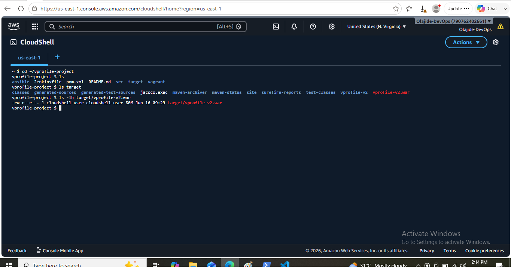
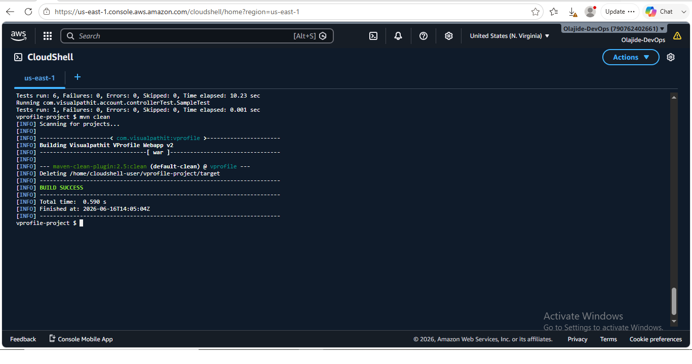
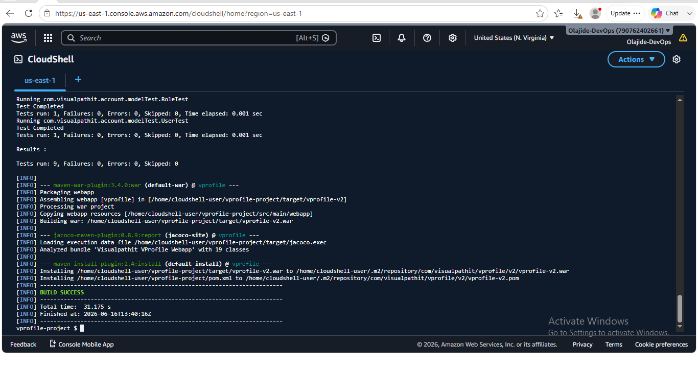
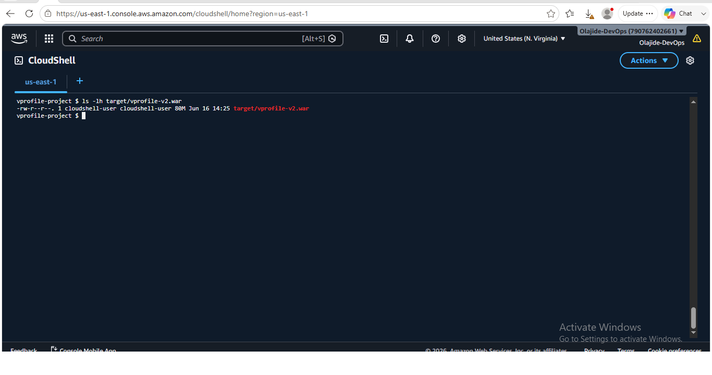

# AWS DevOps Build Tools Project (Maven)

## 📌 Project Overview

This project demonstrates the use of Maven as a Build Tool in a DevOps workflow to automate Java application builds, manage dependencies, and generate deployable artifacts.

The project was executed using the vProfile Java web application and focuses on understanding the Maven build lifecycle, artifact generation, and CI/CD readiness.

As part of this hands-on implementation, Maven was used to compile source code, execute tests, package the application, and generate a deployable WAR artifact suitable for deployment in enterprise environments.

## 📌 Business Problem

In modern software development, manually compiling source code, managing dependencies, and packaging applications can be time-consuming and error-prone.

Without a standardized build process, teams often face challenges such as:

- Inconsistent build environments
- Dependency conflicts
- Build failures due to missing libraries
- Difficulty reproducing builds across teams
- Delays in software delivery pipelines

Organizations require reliable and repeatable build automation processes to ensure software can be consistently built, tested, packaged, and prepared for deployment.

Maven addresses these challenges by providing a structured build lifecycle, centralized dependency management, and automated artifact generation for Java applications.

## 🎯 Project Objectives

The main objectives of this project are:

- To understand the Maven build lifecycle in a real-world DevOps workflow
- To automate Java application build processes
- To manage project dependencies using Maven (pom.xml)
- To execute build phases including clean, compile, test, and package
- To generate deployable artifacts (WAR file)
- To prepare the project for CI/CD pipeline integration
- To simulate real-world software build automation practices used in industry

  ## ☁️ AWS Services Used

Although this project is primarily focused on Build Tools, the execution was carried out in a cloud-based development environment.

- AWS CloudShell (Linux-based environment for execution)
- GitHub (Source code version control and repository hosting)

  ---

## 🏗️ Solution Architecture

text
Developer
   ↓
GitHub Repository (Source Code)
   ↓
AWS CloudShell (Linux Environment)
   ↓
Maven Build Tool
   ↓
Build Lifecycle (clean → compile → test → package)
   ↓
WAR Artifact Generation
   ↓
Output Stored in target/ Directory

---

## 🔄 Project Development Workflow

The project was implemented using the following workflow:

### Step 1: Environment Preparation

- Accessed AWS CloudShell environment
- Verified Java installation
- Verified Maven installation

### Step 2: Source Code Setup

- Cloned the vProfile application source code from GitHub
- Navigated to the project directory

### Step 3: Maven Build Execution

Executed the Maven build lifecycle:

bash
mvn clean
mvn compile
mvn test
mvn package
mvn install

### Step 4: Artifact Generation

- Maven successfully compiled the application
- Dependencies were downloaded automatically
- Build artifact was generated successfully

### Step 5: Validation

- Verified build success
- Confirmed WAR artifact generation
- Confirmed artifact availability inside the target directory

---

## 📸 Project Screenshots

### 1. VProfile Project Setup

This screenshot shows the successful cloning and preparation of the vProfile application source code before the build process.

---

### 2. Maven Clean Execution

This screenshot shows the successful execution of the Maven clean phase, which removes previous build artifacts and prepares the project for a fresh build.

---

### 3. Maven Build Success

This screenshot shows the successful completion of the Maven build lifecycle, confirming that the application compiled and packaged successfully.

---

### 4. WAR Artifact Generation

This screenshot shows the generated WAR artifact inside the target directory, confirming successful packaging and deployment readiness.

